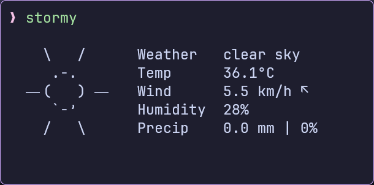
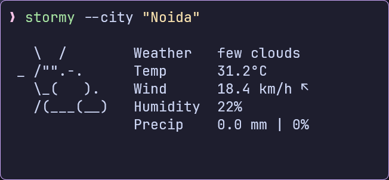

# stormy

Neofetch-like, minimalistic, and customizable weather CLI inspired by
[rainy](https://github.com/liveslol/rainy), rewritten in Go.


## Motivation

stormy’s idea, structure, and design are based off
[rainy](https://github.com/liveslol/rainy), but it’s written in Go instead of
Python, making it noticeably faster.

I built this because I really liked the concept of a Neofetch-style weather CLI.
The simplicity and visual appeal of _rainy_ instantly clicked with me, and I
wanted to recreate that experience in Go — partly for my own satisfaction and
partly because I enjoy building clean CLI tools.

## Features

- Current weather conditions with ASCII art representation
- Temperature, wind, humidity, and precipitation information
- Customizable units (metric, imperial, standard)
- Local configuration file
- Color support for terminals
- Compact display mode

## Installation

### Prerequisites

- Go 1.19 or higher
- An API key from [OpenWeatherMap](https://openweathermap.org/api)

### Build from Source

```bash
# Clone the repository
git clone https://github.com/ashish0kumar/stormy.git
cd stormy

# Build the application
go build

# Move to a directory in your PATH (optional)
sudo mv stormy /usr/local/bin/
```

## Configuration

`stormy` will create a default configuration file on first run:

- Linux/macOS: `~/.config/stormy/stormy.toml`
- Windows: `%APPDATA%\stormy\stormy.toml`

### Configuration Options

- `api_key`: Your OpenWeatherMap API key.
- `city`: The city for which to fetch weather data.
- `units`: Units for temperature and wind speed (`metric`, `imperial` or
  `standard`).
- `showcityname`: Whether to display the city name (`true` or `false`).
- `use_colors`: Enables and disables text colors (`true` or `false`).
- `compact`: Use a more compact display format (`true` or `false`).

### Example Config

```toml
api_key = "your_api_key"
city = "New Delhi"
units = "metric"
showcityname = false
use_colors = false
compact = false
```

## Usage

```bash
# Basic usage
stormy

# Specify city via command line
stormy --city "New York"

# Use imperial units
stormy --units imperial

# Use compact display mode
stormy --compact

# Show help
stormy --help
```

## Display Examples

|     |   |
| ------------------------- | -------------------------- |
|  |  |
|        |         |
|        |         |

## Acknowledgements

- [OpenWeatherMap](https://openweathermap.org/) for providing weather data
- [rainy](https://github.com/liveslol/rainy) for the overall idea, structure and
  design of the project
- [wttr.in](https://github.com/chubin/wttr.in?tab=readme-ov-file) for the ASCII
  weather icons

## License

[MIT](LICENSE)
