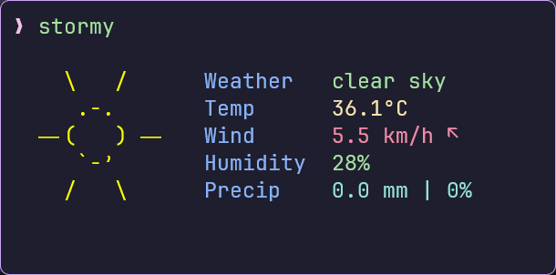
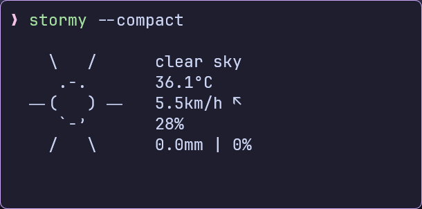
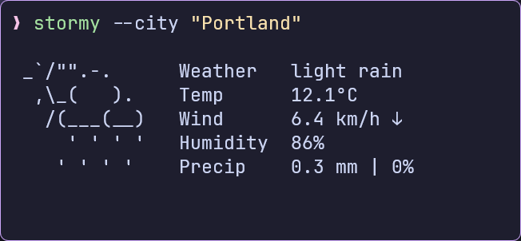
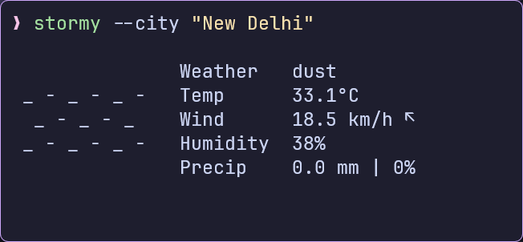

<h1 align="center">stormy</h1>

<p align="center">
Minimal, customizable, and neofetch-like weather CLI inspired by
<a href="https://github.com/liveslol/rainy">rainy</a>, written in Go
</p>

<div align="center">
  
</div>

<br>

<p align="center">
<a href="https://terminaltrove.com/stormy/">

</a>
</p>

---

## Motivation

stormy’s idea, structure, and design are based off
[rainy](https://github.com/liveslol/rainy), but it’s written in Go instead of
Python.

I built this because I really liked the concept of a Neofetch-style weather CLI.
The simplicity and visual appeal of _rainy_ instantly clicked with me, and I
wanted to recreate that experience in Go — partly for my own satisfaction and
partly because I enjoy building clean CLI tools.

## Features

- Multiple weather providers: OpenMeteo (default, no API key required) and OpenWeatherMap
- Current weather conditions with ASCII art representation
- Temperature, wind, humidity, and precipitation information
- Customizable units (metric, imperial, standard)
- Local configuration file
- Color support for terminals
- Compact display mode
- Works out of the box with OpenMeteo

## Installation

### Prerequisites

- Go 1.19 or higher
- **Optional:** An API key from [OpenWeatherMap](https://openweathermap.org/api)

### Via `go install`

```bash
go install github.com/ashish0kumar/stormy@latest
```

### Build from Source

```bash
# Clone the repository
git clone https://github.com/ashish0kumar/stormy.git
cd stormy

# Build the application
go build

# Move to a directory in your PATH
sudo mv stormy /usr/local/bin/
```

## Configuration

`stormy` follows the XDG Base Directory Specification for configuration files and will create a default configuration
file on first run:

- Linux/macOS: `~/.config/stormy/stormy.toml`
- Windows: `%APPDATA%\stormy\stormy.toml`
- Custom: Set `XDG_CONFIG_HOME` environment variable to override the default location

### Configuration Options

- `provider`: Weather data provider ("`OpenMeteo`" or "`OpenWeatherMap`"). Defaults to "`OpenMeteo`".
- `api_key`: Your OpenWeatherMap API key.
- `city`: The city for which to fetch weather data.
- `units`: Units for temperature and wind speed (`metric`, `imperial` or
  `standard`).
- `showcityname`: Whether to display the city name (`true` or `false`).
- `use_colors`: Enables and disables text colors (`true` or `false`).
- `live_mode`: Enables the "live" mode — long-running mode with frequent polling, never stops (`true` or `false`).
- `compact`: Use a more compact display format (`true` or `false`).

### Example Config

#### Default Configuration (OpenMeteo — No API Key Required)

```toml
provider = "OpenMeteo"
api_key = ""
city = "New Delhi"
units = "metric"
showcityname = false
use_colors = false
live_mode = false
compact = false
```

#### OpenWeatherMap Configuration

```toml
provider = "OpenWeatherMap"
api_key = "your_openweathermap_api_key"
city = "New Delhi"
units = "metric"
showcityname = false
use_colors = false
live_mode = false
compact = false
```

## Usage

```bash
# Basic usage
stormy

# Specify city via command line
stormy --city "New York"

# Use imperial units
stormy --units imperial

# Use compact display mode
stormy --compact

# Show version
stormy --version

# Show help
stormy --help
```

## Display Examples

|        |     |
|----------------------------------|-------------------------------------|
|  |  |
|              |                 |
|              |                 |

## Acknowledgements

- [OpenWeatherMap](https://openweathermap.org/) and [Open-Meteo](https://open-meteo.com/) for providing weather data
- [rainy](https://github.com/liveslol/rainy) for the overall idea, structure, and
  design of the project
- [wttr.in](https://github.com/chubin/wttr.in?tab=readme-ov-file) for the ASCII
  weather icons

## Contributing

Contributions are always welcome! If you have ideas, bug reports, or want to submit code, please feel free to open an issue or a pull request.

## Contributors

<a href="https://github.com/ashish0kumar/stormy/graphs/contributors">
  
</a>

<br><br>

<p align="center">
  
</p>

<p align="center">
  <i><code>&copy 2025-present <a href="https://github.com/ashish0kumar">Ashish Kumar</a></code></i>
</p>

<div align="center">
  <a href="https://github.com/ashish0kumar/stormy/blob/main/LICENSE"></a>&nbsp;&nbsp;
</div>
